# Лабораторная работа №3
**Студент:** Руденко Михаил, Б05  
**Тема:** Малоранговые приближения и сжатие изображений  
**Язык программирования:** Python  

---

## 1. Сжатие монохромных изображений при помощи SVD-разложения

### Реализация:

1. **Чтение изображения:**
   - Изображение в формате BMP конвертируется в градации серого (`convert('L')`)
   - Преобразуется в матрицу значений типа `np.float32`

2. **SVD-разложение:**
   - Выполняется SVD-разложение одним из методов (по умолчанию - `numpy.linalg.svd`)
   - Матрица представляется в виде: `M = U × Σ × V^T`

3. **Выбор ранга для сжатия:**
   - Для заданного коэффициента сжатия `N` вычисляется максимальный ранг `r`, удовлетворяющий условию:
     ```
     размер_сжатого_файла ≤ размер_исходного / N
     ```
   - Размер сжатого файла рассчитывается как:
     ```
     r × (rows + cols + 1) × 4 байта
     ```

4. **Сохранение сжатых данных:**
   - Сохраняются первые `r` столбцов матрицы `U`
   - Сохраняются первые `r` сингулярных значений `Σ`
   - Сохраняются первые `r` строк матрицы `V^T`
   - Данные сохраняются в пользовательском формате 

### Восстановление:

1. **Чтение сжатого файла:**
   - Загрузка метаданных (размеры изображения, ранг)
   - Загрузка матриц `U`, `Σ`, `V^T`

2. **Восстановление изображения:**
   - Матрица восстанавливается по формуле: `M_rec = U × diag(Σ) × V^T`
   - Значения обрезаются до диапазона [0, 255]
   - Сохранение в формате BMP

---

## 2. Полиномиальная аппроксимация для поиска чувствительной матрицы

### Поиск оптимальных коэффициентов полинома

Для создания матрицы, которая максимально проявляет различия между алгоритмами SVD, используется следующий подход:

#### **Алгоритм поиска:**
1. **Генерация случайных коэффициентов** многочлена в диапазоне [-10, 10]
2. **Создание матрицы** по формуле полинома от индексов (i, j)%256
3. **Вычисление метрики различия** между SVD-алгоритмами
4. **Сохранение лучших коэффициентов**, дающих максимальное различие

#### **Ключевые функции:**

```python
def calculate_polynom(x, y, c=[0]*10):
    return (c[0] + c[1]*x + c[2]*y+ c[3]*(x**2) + c[4]*(y**2) + c[5]*(x*y) + c[6]*(x**3) + c[7]*(y**3) + c[8]*(x*x*y) + c[9]*(x*y*y)) % 256

def create_matrix(m=800, n=533, coef=[3,-8,4,-1,-10,-10,-1,8,4,-5]):
    M = np.zeros((m, n))
    M = np.fromfunction(lambda i, j: calculate_polynom(i, j, c=coef), (m, n))
    return M

def calculate_difference_metric(M):
    s1 = compute_svd_numpy(M)[1]
    s2 = compute_svd_scipy(M)[1]

    a = np.sort(s1)
    b = np.sort(s2)

    mask = (a != 0) & (b != 0)
    c = np.zeros_like(a)
    c[mask] = np.maximum(a[mask]/b[mask], b[mask]/a[mask])

    return np.linalg.norm(c)

def one_step_opt():
    c = np.random.randint(low=-10, high=10, size=10)
    M = create_matrix(coef=c)
    diff = calculate_difference_metric(M)
    return diff, c
```
закоментированный код - поиск его коэффициентов, дающих матрицу kill_image.bmp


### Randomized SVD

```python 
def randomazid_svd(M, k=30):
    m, n = M.shape
    Omega = np.random.uniform(size=(n, k))
    Y = M @ Omega
    Q, _ = np.linalg.qr(Y)
    B = Q.T @ M
    u, S, V = np.linalg.svd(B, full_matrices=0)
    U = Q @ u
    return U, S, V
```

Реализован стандартный алгоритм рандомизированного свд https://towardsdatascience.com/intuitive-understanding-of-randomized-singular-value-decomposition-9389e27cb9de/
Его идея в том, что можно спроецировать исходный оператор в пространство меньшей размерности и выполнить разложение в нем, существенно экономя ресурсы.

В качестве метррик ухудшения качества изображения выбраны две наиболее популярные для этой задачи: PSNR и SSIM.


**PSNR (Peak Signal-to-Noise Ratio)**:
$$
\text{PSNR} = 10 \log_{10} \left( \frac{255^2}{\text{MSE}} \right),
$$
где
$$
\text{MSE} = \frac{1}{mn} \sum_{i=1}^{m} \sum_{j=1}^{n} [I(i,j) - \hat{I}(i,j)]^2.
$$

**SSIM (Structural Similarity Index)**:
$$
\text{SSIM}(x,y) = \frac{(2\mu_x\mu_y + C_1)(2\sigma_{xy} + C_2)}{(\mu_x^2 + \mu_y^2 + C_1)(\sigma_x^2 + \sigma_y^2 + C_2)},
$$
где $\mu_x, \mu_y$ — средние значения, $\sigma_x^2, \sigma_y^2$ — дисперсии, $\sigma_{xy}$ — ковариация, а константы $C_1 = (0.01\cdot L)^2$, $C_2 = (0.03\cdot L)^2$ с $L=255$ (для 8-битных изображений).


### Изображение pig1.bmp

**Оригинал:**
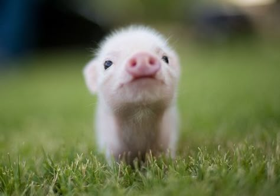

**Визуальное сравнение:**
| Метод / N | N = 2 | N = 4 | N = 8 |
|:----------|:-----:|:-----:|:-----:|
| **Стандартное SVD** | 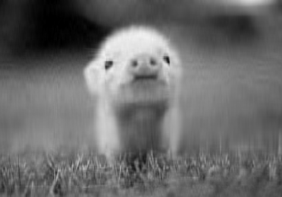 |  | 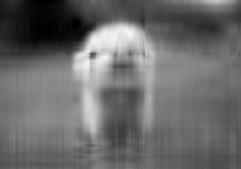 |
| **Рандомизированное SVD** |  | 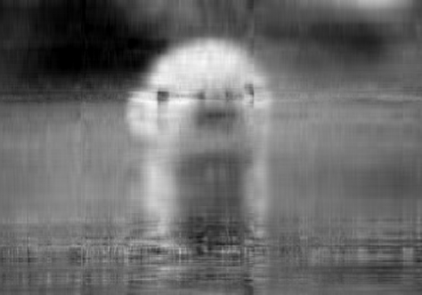 | 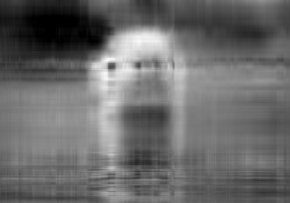 |

**Метрики качества:**
| Метод / N | N = 2 | N = 4 | N = 8 |
|:----------|:-----:|:-----:|:-----:|
| **PSNR** | 34.97218<br>31.00997 | 30.61214<br>27.20247 | 27.62790<br>24.39983 |
| **SSIM** | 0.99536<br>0.98830 | 0.98715<br>0.97134 | 0.97408<br>0.94377 |

*Примечание: в каждой ячейке верхнее значение — стандартное SVD, нижнее — рандомизированное SVD.*

---

### Изображение pig2.bmp

**Оригинал:**
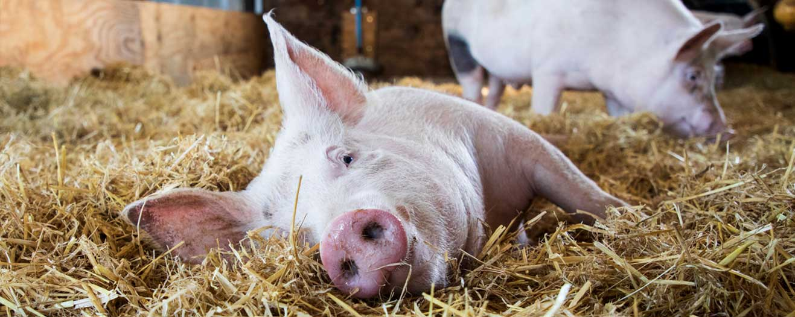

**Визуальное сравнение:**
| Метод / N | N = 2 | N = 4 | N = 8 |
|:----------|:-----:|:-----:|:-----:|
| **Стандартное SVD** |  | 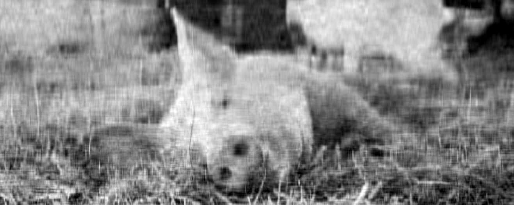 | 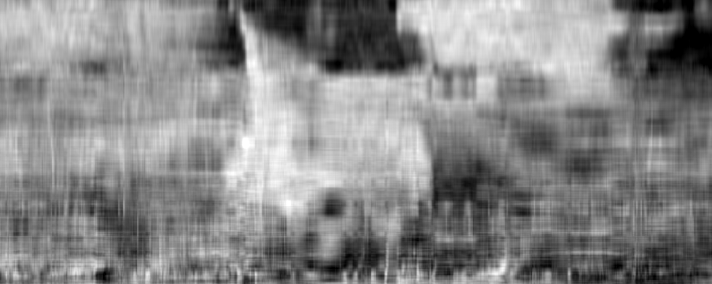 |
| **Рандомизированное SVD** | 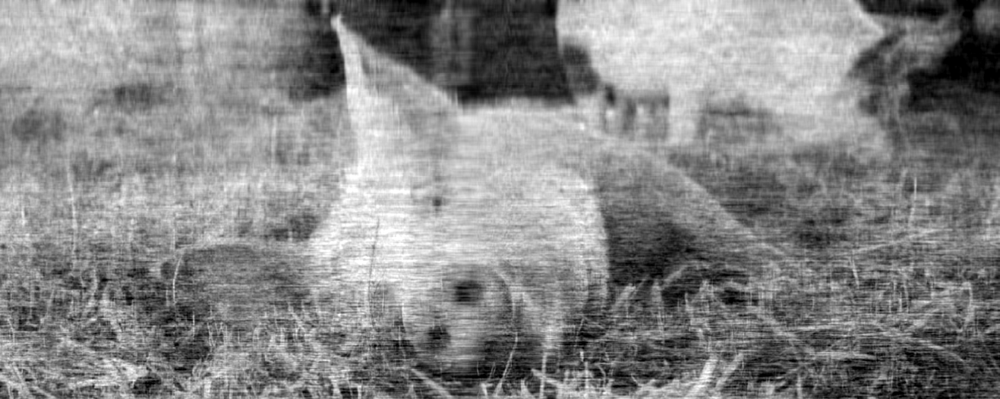 | 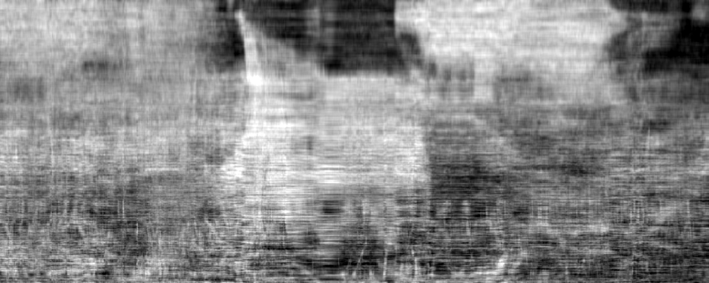 | 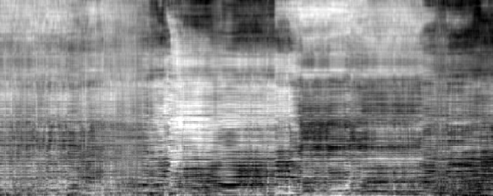 |

**Метрики качества:**
| Метод / N | N = 2 | N = 4 | N = 8 |
|:----------|:-----:|:-----:|:-----:|
| **PSNR** | 24.49649<br>21.31018 | 21.57313<br>19.02157 | 19.46646<br>17.22541 |
| **SSIM** | 0.96589<br>0.92612 | 0.93079<br>0.86819 | 0.88250<br>0.78631 |

---

### Изображение pig3.bmp

**Оригинал:**
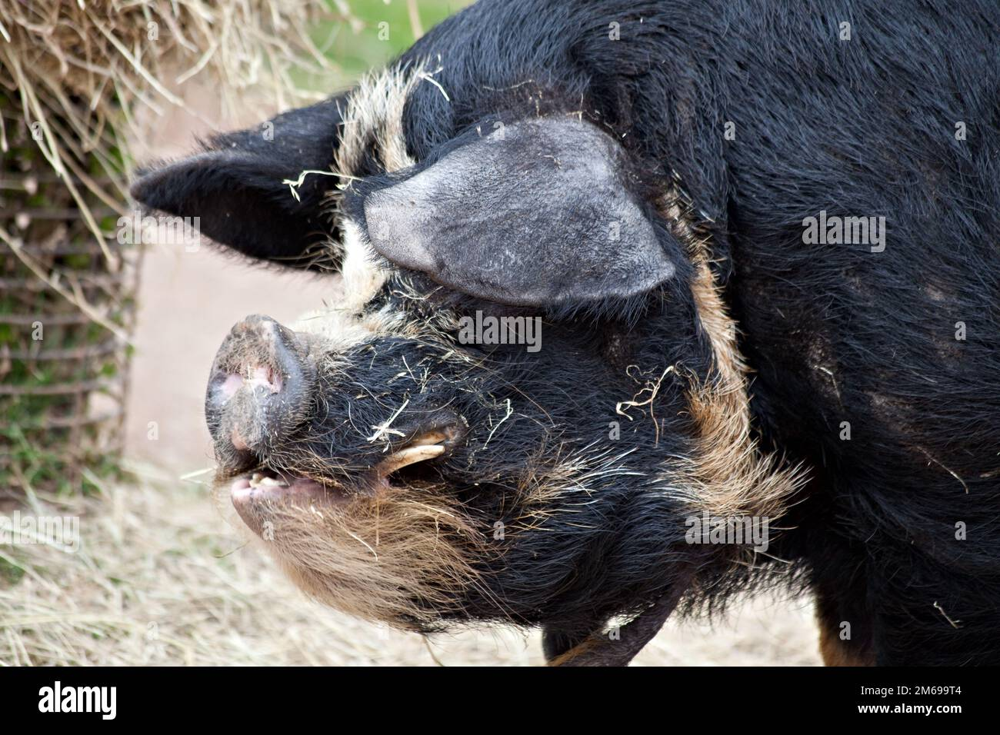

**Визуальное сравнение:**
| Метод / N | N = 2 | N = 4 | N = 8 |
|:----------|:-----:|:-----:|:-----:|
| **Стандартное SVD** |  |  |  |
| **Рандомизированное SVD** | 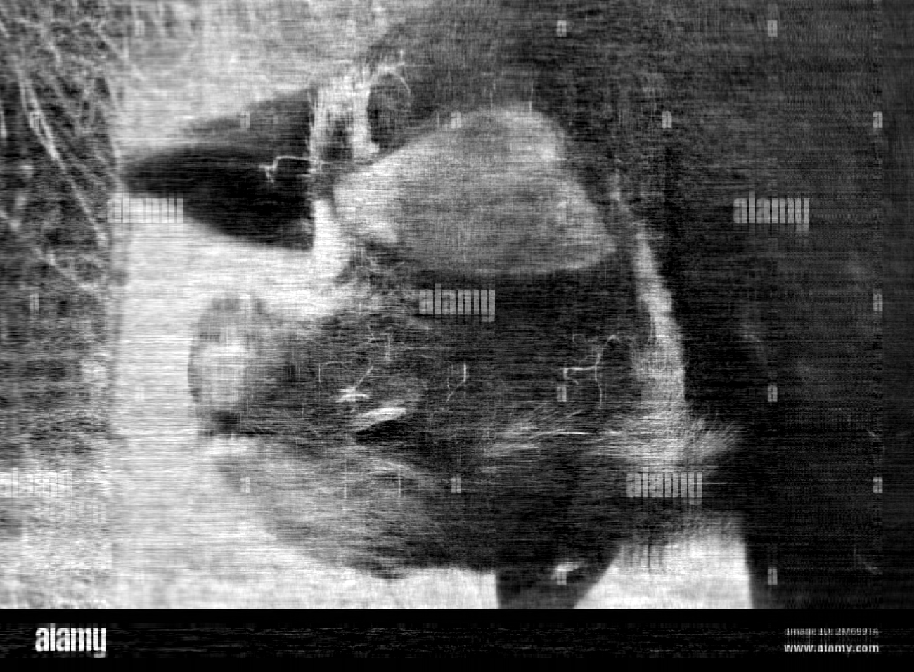 | 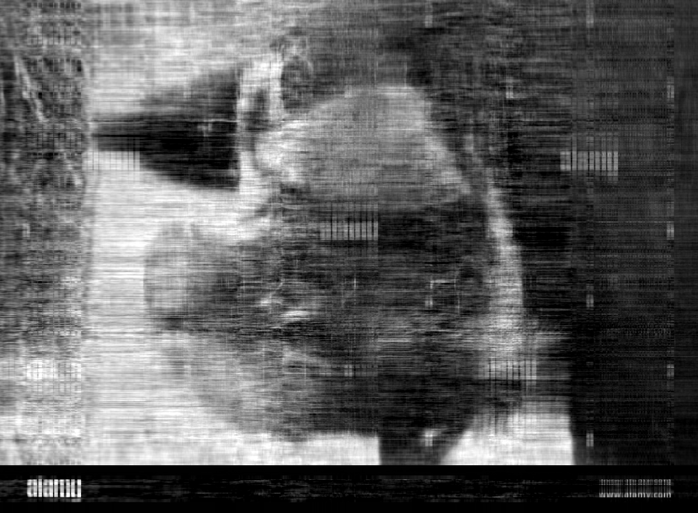 |  |

**Метрики качества:**
| Метод / N | N = 2 | N = 4 | N = 8 |
|:----------|:-----:|:-----:|:-----:|
| **PSNR** | 24.43352<br>21.47369 | 22.29849<br>19.51263 | 20.55562<br>18.03839 |
| **SSIM** | 0.97933<br>0.95812 | 0.96574<br>0.93252 | 0.94798<br>0.90267 |